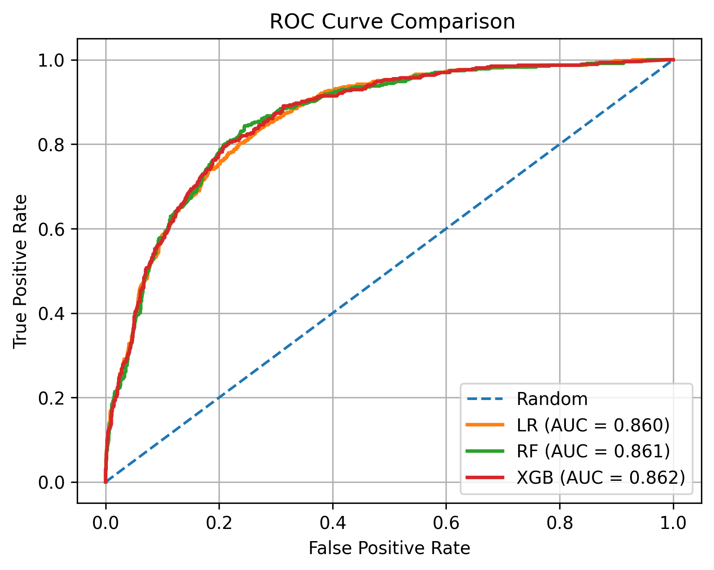
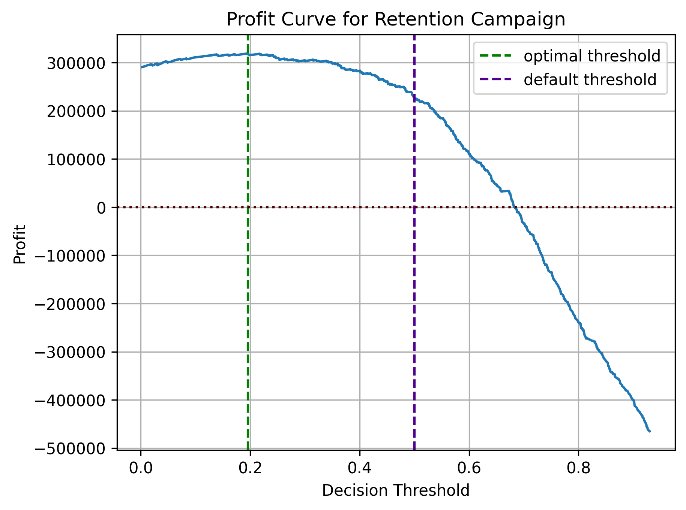

# README – Telco Customer Churn Prediction

## Project Overview

Customer churn is a major challenge for telecom companies. Acquiring a new customer is typically much more expensive than retaining an existing one, making churn prediction an important business task.

The goal of this project is to build machine learning models that predict whether a customer will churn and identify the key factors driving customer attrition.

The project demonstrates a complete machine learning workflow, including:

* exploratory data analysis
* feature engineering
* model training and evaluation
* model comparison
* interpretation of churn drivers
* business-oriented decision optimization

The project focuses on balancing predictive performance with interpretability and business relevance.

## Dataset

The project uses the Telco Customer Churn dataset, which contains information about telecom customers, including:

* customer demographics
* contract type
* service subscriptions
* billing information
* churn status

Each row represents a customer, and the target variable indicates whether the customer churned.

## Project Structure

├── notebooks
│   ├── 01_eda.ipynb
│   ├── 02_feature_engineering.ipynb
│   └── 03_modeling.ipynb
│
├── data
│   ├── raw
│   │   └── WA_Fn-UseC_-Telco-Customer-Churn.csv
│   ├── processed
│   │   └── EDA-Telco-customer-churn.csv
│   ├── X_train.pkl
│   ├── X_test.pkl
│   ├── y_train.pkl
│   └── y_test.pkl
│
├── figures
│   ├── profit_curve.png
│   └── ROC_Curve_comparison.png
│
└── README.md

## Models Used

Three model families were evaluated:

### Logistic Regression

Used as an interpretable baseline model.

Advantages:

* easy interpretation of feature effects
* transparent decision logic

### Random Forest

A tree-based ensemble model capable of capturing nonlinear relationships and interactions between features.

### XGBoost

A gradient boosting model known for strong predictive performance on structured datasets.

## Model Performance

All models achieved similar predictive performance.

| Model | ROC-AUC | Recall (churn) | Precision (churn) | Accuracy |
|------|------|------|------|------|
| Logistic Regression | ~0.84 | high | moderate | good |
| Random Forest | ~0.84 | high | better precision | good |
| XGBoost | ~0.84 | lower | highest precision | best accuracy |

Key observations:

* Logistic Regression detects most churners but produces more false positives.
* Random Forest provides the best balance between precision and recall.
* XGBoost is conservative, identifying fewer churners but with higher precision.

## Key Drivers of Customer Churn

Across all models, the most important churn predictors were:

### Contract Type

Customers with month-to-month contracts show significantly higher churn probability compared to customers with long-term contracts.

### Customer Tenure

New customers are much more likely to churn, suggesting that the first months of the customer lifecycle are critical for retention.

### Internet Service Type

Customers using fiber optic service demonstrate higher churn risk, possibly due to pricing sensitivity or increased competition.

### Payment Method

Customers paying via electronic check show elevated churn probability compared to customers using automatic payment methods.

### Service Bundling

Service bundling has a moderate retention effect. Each additional core service reduces the odds of churn by approximately 20%, although the effect is weaker than contract and tenure factors.

## Profit Optimization

In churn prediction, the default classification threshold (0.5) is rarely optimal from a business perspective.

To illustrate this, the project includes cost-based threshold optimization.

Different decision thresholds are evaluated based on assumed business values:

* customer retention profit
* retention campaign cost

The optimal threshold maximizes the expected profit of the retention strategy.

A profit curve is used to show how different thresholds affect the profitability of retention campaigns.

This demonstrates how machine learning models can be aligned with real business objectives, not only statistical metrics.

## Technologies Used

* Python
* pandas
* scikit-learn
* XGBoost
* matplotlib
* seaborn
